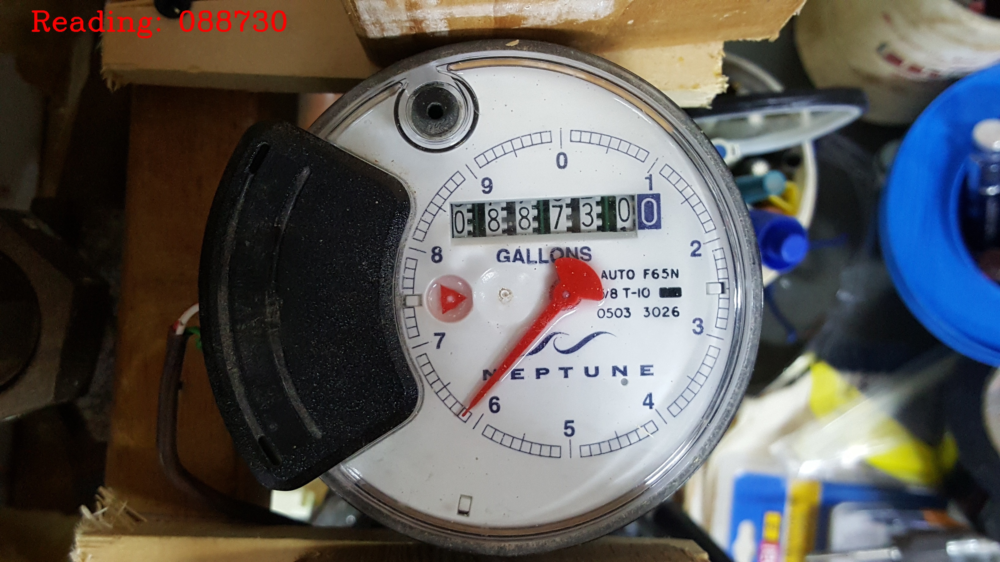

# Gas Meter Reading


---

## Table of Contents

- [Overview](#overview)
- [Features](#features)
- [Technologies Used](#technologies-used)
- [Installation](#installation)
- [Usage](#usage)
- [File Structure](#file-structure)
- [Contributing](#contributing)
- [License](#license)

---

## Overview

This repository contains a comprehensive solution for **Gas Meter Reading** using state-of-the-art image processing techniques. The project is designed to automate the process of reading gas meters from images that can be used to generate the bill automatically.

---

## Features

- **Meter Extraction**: Automatically segment the meter.
- **Digit Detection**: Automatically detects the digits area.
- **OCR Integration**: Extracts and recognizes the digits from the detected area.
- **Preprocessing Pipeline**: Includes image enhancements for low-quality images.

---

## Technologies Used

- **Python**
- **OpenCV**
- **Tesseract OCR**
- **Matplotlib**

---

## Installation

To get started with the project, follow these steps:

1. **Clone the repository and ;Navigate to the Directory:**
   ```bash
   git clone https://github.com/tayyabwahab/Gas-meter-Reading.git
   cd Gas-meter-Reading
   ```

2. **Setting up Virtual Environment**

   It is recommended to use a virtual environment to avoid conflicts with other projects.

   ```bash
   pip install virtualenv    # Install virtualenv to create virtual environments
   virtualenv VEnv           # Create Virtual Environment
   source VEnv/bin/activate  # Activate Virtual Environment (On Windows use `VEnv\Scripts\activate)`
   ```

3. **Install dependencies:**
   ```bash
   pip install -r requirements.txt
   ```

---

## Usage

1. Set the path to input and output image in the script.
2. Run the scripy below:
   ```bash
   python GasMeterReading.py
   ```
---

## Results

Here is how the output looks like:




Below are the trajectories of each ball in the video. 


## How It Works

1. **Preprocessing**:
   - The input image is converted to grayscale for simpler processing.
   - Binary thresholding and morphological operations enhance the image, making the digits more prominent.

2. **Digit Detection**:
   - Contours are identified in the processed image to locate possible digit regions.
   - Filters based on width and height are applied to isolate valid digit contours.

3. **Digit Recognition**:
   - Extracted digit regions are resized for consistency.
   - Each digit is matched against a set of pre-stored reference images to determine the best match using template matching.

4. **Sorting Digits**:
   - Identified digits are sorted based on their x-coordinates to maintain the correct sequence.

5. **Result Compilation**:
   - The recognized digits are combined to form the final meter reading.

6. **Visualization**:
   - The recognized reading is displayed on the original image.
   - The processed image with the reading overlaid is shown using OpenCV.

---
